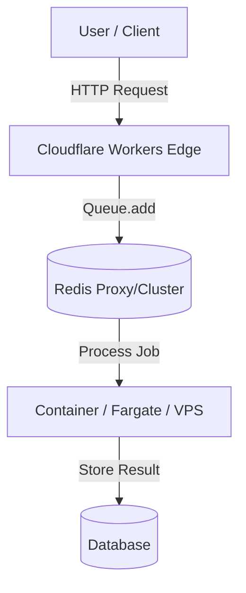

# Producer/Consumer Architecture in ZinTrust

## Overview

ZinTrust employs a **Split Architecture** deployment model when running on serverless edge platforms like Cloudflare Workers. This architecture decouples job production (enqueueing) from job consumption (processing) to respect runtime limitations.



- **Producer (Edge)**: Runs on Cloudflare Workers. Handles ephemeral HTTP requests, enqueues background jobs, and returns fast responses.
- **Consumer (Origin)**: Runs in a persisted container (Docker/Node.js). Maintains persistent connections to Redis, processes jobs, handling long-running tasks.

## Why Split?

Cloudflare Workers and similar edge runtimes have specific limitations unsuitable for traditional queue workers:

1.  **No Persistent TCP**: Workers cannot keep a Redis connection open indefinitely for `BLPOP`/subscription.
2.  **Request Lifecycle**: Workers are meant to spin down immediately after sending a response. Background processing is limited.
3.  **Global Scope**: BullMQ and similar libraries often rely on global state or socket pooling incompatible with V8 isolate freeze/thaw cycles.

## Configuration

To support this, ZinTrust uses the `RUNTIME_MODE` and feature flags.

### Producer (Cloudflare)

Settings for `wrangler.jsonc` or `.env.producer`:

```bash
RUNTIME_MODE=cloudflare-workers
WORKER_ENABLED=false
QUEUE_ENABLED=true
USE_REDIS_PROXY=true
```

### Consumer (Container)

Settings for `docker-compose.yml` or `.env`:

```bash
RUNTIME_MODE=containers
WORKER_ENABLED=true
WORKER_AUTO_START=true
QUEUE_ENABLED=true
```

## Local Development

You can simulate this split architecture locally using the CLI:

```bash
zin dev --mode=split
```

This spawns two processes:

1.  **Web**: The API server (configured as Producer)
2.  **Worker**: The background process (configured as Consumer)
